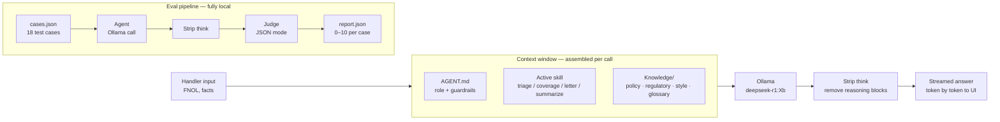

# Claims Copilot

> A context folder for an insurance claims handler — not just a prompt.

This repo is an opinionated example of **context engineering** for a regulated, high-stakes role. It shows how to set up an AI assistant for a First Notice of Loss (FNOL) claims handler — the person on the other end of the phone when your car gets hit or your house floods.

**Fully local. No API keys. No cloud.** Both the demo and the evals run via Ollama on your machine.

All policy wordings, claim files, and customer data in this repo are **synthetic**. Nothing here is real insurance content.

---

## What's in here

```
claims-copilot/
├── AGENT.md                        # Role, guardrails, and reasoning pattern
├── knowledge/
│   ├── policy wording/
│   │   ├── motor_policy.md
│   │   ├── home_policy.md
│   │   └── travel_policy.md
│   ├── regulatory.md               # GDPR + fair-treatment rules
│   ├── style.md                    # Tone of voice, forbidden phrases
│   └── glossary.md                 # Claims jargon, demystified
├── skills/
│   ├── triage-claim.md
│   ├── coverage-check.md
│   ├── draft-letter.md
│   └── summarize-file.md
├── evals/
│   ├── cases.json                  # 18 test cases
│   └── run.py                      # Fully local eval runner (Ollama)
└── demo/
    └── app.py                      # Streamlit app with streaming + model picker
```

---

## System architecture



The key design decision: the model is generic — what makes it behave like a claims assistant is the **context window**, assembled fresh on every call from three layers: the role definition (`AGENT.md`), the active skill playbook, and the full knowledge base. Swap the skill file and you get completely different assistant behaviour without touching the model.

The eval pipeline mirrors the demo pipeline exactly — same Ollama stack, same context assembly — so what you measure reflects what you ship.

---

## Quickstart

### 1. Install dependencies

```bash
pip install streamlit ollama
```

Make sure [Ollama](https://ollama.com) is installed and running.

### 2. Pull a model

```bash
ollama pull deepseek-r1:7b      # balanced — recommended starting point
# or
ollama pull deepseek-r1:1.5b   # much faster, lower quality
# or
ollama pull deepseek-r1:14b    # best quality, needs more RAM
```

### 3. Run the demo

```bash
streamlit run demo/app.py
```

Open `http://localhost:8501`.

Pick a **skill** and a **model**, paste in an FNOL or claim scenario, and hit **Run**. Text streams in token by token — no waiting for the full response.

Use the **"Show model reasoning"** toggle to see the raw `<think>` blocks from deepseek-r1 as they stream in.

---

## How it works

When you hit Run, the app assembles a single context window from three layers:

```
AGENT.md  +  skills/{selected_skill}.md  +  all knowledge/*.md
```

The model itself is generic. What makes it behave like a claims assistant is the context — the role definition, the regulatory constraints, the policy wordings, and the skill-specific reasoning patterns — loaded fresh on every call.

---

## Model guide

| Model | Speed | RAM needed | Best for |
|---|---|---|---|
| `deepseek-r1:1.5b` | Fast | ~2 GB | Quick iteration, demos |
| `deepseek-r1:7b` | Moderate | ~5 GB | Day-to-day use |
| `deepseek-r1:14b` | Slow | ~10 GB | Best quality output |

If the 7b feels slow, switch to 1.5b in the UI dropdown — no restart needed.

---

## Run the evals

The eval runner is also **fully local** — no Anthropic API key needed. It uses Ollama for both the agent and the judge.

```bash
python evals/run.py
```

This runs all 18 cases, scores each with a Claude-style judge rubric (per-expectation PASS/FAIL + overall score out of 10), and writes `evals/report.json`.

**Override models:**

```bash
# Use 1.5b as agent (faster), keep 7b as judge (more reliable scoring)
python evals/run.py --agent-model deepseek-r1:1.5b --judge-model deepseek-r1:7b
```

The 18 eval cases cover: standard FNOL triage, coverage edge cases, letter drafting, guardrail tests (handler tries to get the agent to set a reserve or commit to coverage), vulnerability signals, and fraud signals.

---

## Option B — Use it in Claude (no code needed)

1. Create a new **Project** in [Claude.ai](https://claude.ai).
2. Paste the contents of `AGENT.md` into the Project's custom instructions.
3. Upload all files from `knowledge/` and `skills/` as Project files.
4. Start a chat:

> *"New FNOL — tree fell on customer's car overnight during a storm. Policy MOT-2024-0192. Customer uses car for work, wants fast resolution."*

---

## Why it's built this way

**AGENT.md over a giant prompt.** One file, version-controlled, readable by a compliance officer. No one should have to scroll thousands of tokens to understand what the agent does or doesn't do.

**Skills as separate files.** Triage, coverage analysis, and letter drafting have different inputs, outputs, and risks. Separating them means you can iterate on one without touching the others.

**Guardrails are specific, not generic.** "Be helpful and harmless" doesn't survive contact with a customer who just totaled their car. The guardrails in AGENT.md name real regulatory concerns: reserves, liability admissions, coverage commitments. Each rule has a reason behind it.

**Streaming for perceived speed.** The model doesn't get faster — but seeing tokens arrive immediately is a much better experience than a 30-second blank screen followed by a wall of text.

**Evals are fully local.** The original version used the Anthropic API as judge, which added cost and a dependency. Now everything runs on your machine. The judge uses Ollama's `format="json"` mode to force valid JSON output, which makes parsing reliable without regex hacks.

---

## What I'd build next

- A tool-use layer so the agent queries a mock policy admin system instead of being handed the wording in context.
- An explicit "escalate to human" path with defined triggers.
- A red-team eval set — adversarial customers, ambiguous coverage, conflicting facts.
- A/B test the system prompt against a version without `style.md` and measure letter quality on the evals.

---

Built as a portfolio piece. Feedback welcome.
